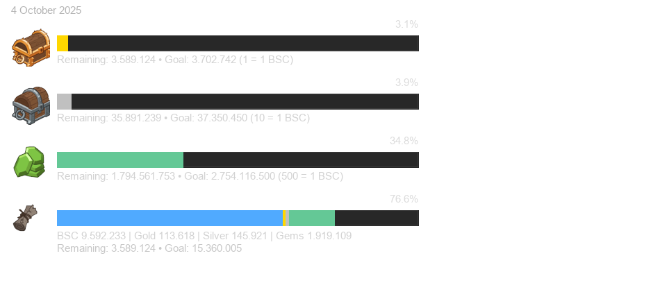

# Road to BrivJ – Overlay





**Generates a PNG overlay showing your progress toward the next Briv Jump** in Idle Champions.  
It reads your local `webRequestLog.txt`, calls the user details endpoint, and renders stacked/goal bars for:
- **Blacksmith Contracts (BSC)**: base + projected from Gold/Silver/Gems
- **Gold-Chests**, **Silver-Chests**, **Gems**: per-resource “what you’d still need if you finished the goal only with this resource”

Repo: `progress_tracker_extended.py` plus the icons used in the overlay.  
(See file list on GitHub for current contents.) :contentReference[oaicite:0]{index=0}

---

## Features

- **Always-on mini setup dialog** on start (Tkinter):
  - Pick your `webRequestLog.txt`
  - Enter your **BSC goal**
  - Choose the **output** path for the PNG
  - Button **“Skip (use saved)”** reuses `tracker_config.json` from last run
- **Dynamic** `mobile_client_version` (parsed from your log) to keep the API call valid
- Clean, compact overlay:
  - **Stacked BSC bar**: Base + Gold + Silver + Gems (in BSC units)
  - **Resource bars**: show *your current units vs the units needed* to close the BSC target
- **Transparent background PNG** suitable for streaming overlays

---

## Requirements

- **Windows + Idle Champions** (default log path below)
- **Python 3.9+** (3.10–3.12 tested)
- Python packages:
  ```bash
  pip install pillow requests
